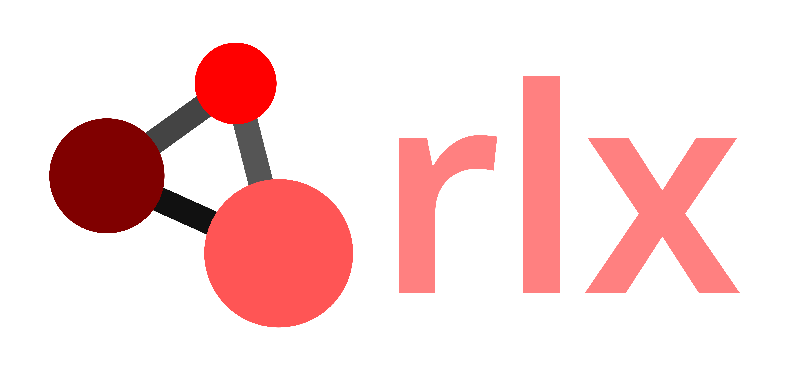

# rlx: Simple Implementations of Deep Reinforcement Learning Algorithms in JAX Flax NNX
<a></a>
Simple baseline RL algorithms implemented in JAX Flax NNX compatable with Gymnasium and MuJoCo Playground / Warp environments. While JAX can provide a significant speed up to computation, it is often not intuitive to use. This is in particular the case for the old API of  Flax - Linen. This repository provides a limited collection of re-implemented algorithms with the NNX API. The single-file design philosophy of [CleanRL](https://github.com/vwxyzjn/cleanrl) inspired the code structure of this repo.

**Features:**
- Single-file implementation of DRL baselines with Flax NNX.
- Checkpointing with [orbax-checkpoint](https://orbax.readthedocs.io/)
- Config management with [hydra](https://hydra.cc)
- Logging with [wandb](https://wandb.ai/)
- Dependency management with [uv](https://docs.astral.sh/uv/) 

**Disclaimer:** This repository is not actively developed and will not provide any further support or documentation. It is intended for hobbyists and as a look-up for the usage of Flax NNX in DRL. For serious research, we recommend more mature frameworks e.g. [stable-baselines3](https://github.com/DLR-RM/stable-baselines3), [BRAX](https://github.com/google/brax), [CleanRL](https://github.com/vwxyzjn/cleanrl) and [RSL-RL](https://github.com/leggedrobotics/rsl_rl). Nevertheless, we provide some benchmarking and fun training examples to validate the functionality of the implemented algorithms.

Also, feel free to provide any useful extensions via a PR or submit an issue.


## Getting started
Setup training environment with `uv`.
```bash
git clone git@github.com:alexanderdittrich/rlx.git
cd rlx 
uv sync
```

Run training:
```bash
uv run src/rlx/ppo.py env_id=CartPole-v1 num_train_steps=500000
```

## Benchmarks

### Gymnasium
- [ ] Gymnasium - Discrete environments: `Acrobot-v1`, `CartPole-v1`, `MountainCar-v0`, `LunarLander-v3`
- [ ] Gymnasium - Continuous environments: `Pendulum-v1`,`BipedalWalker-v3`,`HalfCheetah-v5`, `Hopper-v5`, `Walker2d-v5`, `Ant-v5`
- [ ] Gymnasium - Vision environments: `CarRacing-v3`, `ALE/SpaceInvaders-v5`, `ALE/Breakout-v5`

### Playground
- [ ] Playground - Continuous environments: `CheetahRun`, `HopperHop`, `HumanoidWalk`, `FishSwim`, `Unitree Go1 Joystick`, `G1 Joystick`, `Leap Reorient`, `Panda Pick`
- [ ] Playground - Vision environments: `CheetahRun`, `HopperHop`, `HumanoidWalk`

## Roadmap:
- [ ] Playground MJX API. 
- [ ] `nnx.scan`-integration.
- [ ] Extensive benchmarking.
- [ ] External learn-API.
- [ ] Checkpointing and replay.
- [ ] Integration of further algorithms -> Rainbow DQN, SAC, DreamerV3.
- [ ] Add some custom performance showcase -> OP3 football / humanoid football.

## Cite

We will not provide any detailed technical report, but if one wishes to cite this framework:

```bibtex
@misc{dittrich2025rlx,
  title={rlx: Simple Implementations of Deep Reinforcement Learning Algorithms in JAX Flax NNX},
  author={Dittrich, Alexander},
  publisher={GitHub},
  journal={GitHub repository},
  howpublished={https://github.com/alexanderdittrich/rlx.git},
  year={2026},
}
```